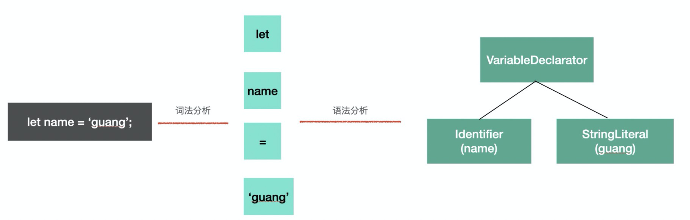
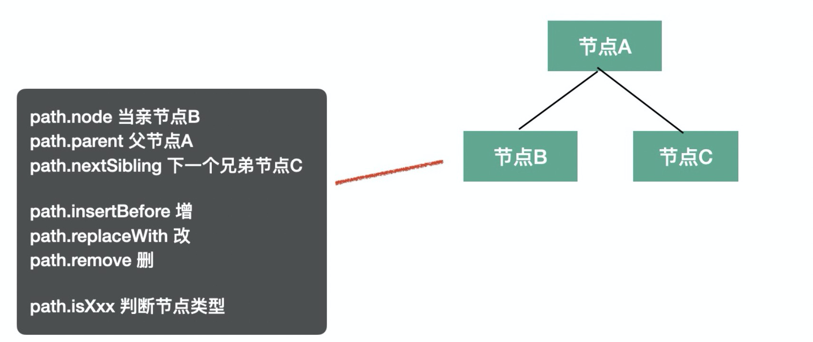

# 《babel 插件通关秘籍》笔记

babel 是一个转译器，分为 `parse`、`transform`、`generate` 三步。

## parse

parse 阶段的目的是把源码字符串转换成机器能够理解的 AST，这个过程分为词法分析、语法分析。

比如 `let name = 'guang';` 这样一段源码，我们要先把它分成一个个不能细分的单词（token），也就是 `let`, `name`, `=`, `'guang'`，这个过程是词法分析，按照单词的构成规则来拆分字符串成单词。

之后要把 token 进行递归的组装，生成 AST，这个过程是语法分析，按照不同的语法结构，来把一组单词组合成对象。

<div style="text-align: center">
  
</div>

## transform

transform 阶段是对 parse 生成的 AST 的处理，会进行 AST 的遍历，遍历的过程中处理到不同的 AST 节点会调用注册的相应的 visitor 函数，visitor 函数里可以对 AST 节点进行增删改，返回新的 AST。这样遍历完一遍 AST 之后就完成了对代码的修改。

## generate

generate 阶段会把 AST 打印成目标代码字符串。

## AST

抽象语法树

[https://astexplorer.net/](https://astexplorer.net/)

常见 AST 节点

- `Literal`：Literal 是字面量的意思，比如 `let name = 'guang'` 中，`'guang'` 就是一个字符串字面量 `StringLiteral`，相应的还有数字字面量 `NumericLiteral`，布尔字面量 `BooleanLiteral`，正则表达式字面量 `RegExpLiteral` 等
- `Identifier`：Identifer 是标识符的意思，变量名、属性名、参数名等各种声明和引用的名字，都是Identifer，Identifier 是变量和变量的引用。例如：const name = 'guang'、function say(name) { console.log(name) }、const obj = { name: 'guang' } 中红色部分都是 Identifier。
- `Statement`：Statement 是语句，它是可以独立执行的单位，比如 break、continue、debugger、return 或者 if 语句、while 语句、for 语句，还有声明语句，表达式语句等。我们写的每一条可以独立执行的代码都是语句。语句是代码执行的最小单位，可以说，代码是由语句（Statement）构成的。
- `Declaration`：Declaration 声明语句是一种特殊的语句，它执行的逻辑是在作用域内声明一个变量、函数、class、import、export 等。
- `Expression`：Expression 是表达式，特点是执行完以后有返回值，这是和语句 (statement) 的区别。表达式的特点是有返回值，有的表达式可以独立作为语句执行，会包裹一层 ExpressionStatement。
- `File & Comment & Program & Directive`：babel 的 AST 最外层节点是 File，它有 program、comments、tokens 等属性，分别存放 Program 程序体、注释、token 等，是最外层节点。`"use strict"` 这种指令会使用 Directive 节点表示

AST 公共属性

- `type`：AST 节点类型
- `start、end、loc`：start 和 end 代表该节点对应的源码字符串的开始和结束下标，不区分行列。而 loc 属性是一个对象，有 line 和 column 属性分别记录开始和结束行列号。
- `leadingComments、innerComments、trailingComments`： 表示开始的注释、中间的注释、结尾的注释，因为每个 AST 节点中都可能存在注释，而且可能在开始、中间、结束这三种位置，通过这三个属性来记录和 Comment 的关联。
- `extra`：记录一些额外的信息，用于处理一些特殊情况。

## babel 的 api

babel 针对不同的步骤封装了不同的 npm 包，parse 阶段使用 `@babel/parser`；transform 阶段使用 `@babel/traverse`、`@babel/types`、`@babel/template`；generate 阶段使用 `@babel/generate`。

### @babel/parser

文档：

[https://babeljs.io/docs/en/babel-parser#api](https://babeljs.io/docs/en/babel-parser#api)

主要提供了两个 api，`parse` 和 `parseExpression`。

两者都是把源码转成 AST，不过 parse 返回的 AST 根节点是 File（整个 AST），parseExpression 返回的 AST 根节点是是 Expression（表达式的 AST），粒度不同。

这两个 api 接收的参数相同，第一个参数是需要转译的字符串，第二个参数是转译的配置 options。

options 内的配置主要分为两类：

- parse 的内容：
    - `plugins`：指定是 jsx、typescript、flow 等插件类解析对应的语法
    - `allowXxx`：指定一些语法是否允许
    - `sourceType`：指定是否支持解析模块语法，有 module、script、unambiguous 3个取值，module 是解析 es module 语法，script 则不解析 es module 语法，当作脚本执行，unambiguous 则是根据内容是否有 import 和 export 来确定是否解析 es module 语法。
- parse 的方式：
    - `strictMode`：是否是严格模式
    - `startLine`：从源码哪一行开始 parse
    - `errorRecovery`：出错时是否记录错误并继续往下 parse
    - `tokens`：parse 的时候是否保留 token 信息
    - `ranges`：是否在 ast 节点中添加 ranges 属性

举个🌰：

```jsx
require("@babel/parser").parse("code", {
  sourceType: "module",
  plugins: [
    "jsx",
    "typescript"
  ]
});
```

### @babel/traverse

文档：

[https://babeljs.io/docs/en/babel-traverse](https://babeljs.io/docs/en/babel-traverse)

只提供了一个 api：`function traverse(ast, opts)`，ast 为指定要遍历的 AST 节点，opts 指定针对不同 ast 类型节点的 visitor 函数或对象。

举个🌰：

```jsx
traverse(ast, {
  'FunctionDeclaration|VariableDeclaration': function (path, state) {},
  // 函数写法默认是 enter
  StringLiteral: {
    enter (path, state) {}, // 进入节点后调用
    exit (path, state) {} // 离开节点前调用
  }
});
```

可以看到，visitor 可以是一个对象或函数，接收两个参数：path、state。

- path：遍历过程中的路径，会保留上下文信息，有很多属性和方法
    - path.node 指向当前 AST 节点
    - path.get、path.set 获取和设置当前节点属性的 path
    - path.parent 指向父级 AST 节点
    - path.findParent 查找是否有某个父节点
    - path.getSibling、path.getNextSibling、path.getPrevSibling 获取兄弟节点
    - path.scope 获取当前节点的作用域信息
    - path.isXxx 判断当前节点是不是 xx 类型
    - path.assertXxx 判断当前节点是不是 xx 类型，不是则抛出异常
    - path.insertBefore、path.insertAfter 插入节点
    - path.replaceWith、path.replaceWithMultiple、replaceWithSourceString 替换节点
    - path.remove 删除节点
    - path.skip 跳过当前节点的子节点的遍历
    - path.stop 结束后续遍历

    <div style="text-align: center">
      
    </div>

- state：遍历过程中在不同节点之间传递数据的机制，插件会通过 state 传递 options 和 file 信息，我们也可以通过 state 存储一些遍历过程中的共享数据。

### @babel/types

文档：

[https://babeljs.io/docs/en/babel-types#api](https://babeljs.io/docs/en/babel-types#api)

用于遍历 AST 的过程中需要创建一些 AST 和判断 AST 的类型。

### @babel/template

文档：

[https://babeljs.io/docs/en/babel-template](https://babeljs.io/docs/en/babel-template)

通过 @babel/types 创建 AST 还是比较麻烦的，要一个个的创建然后组装，如果 AST 节点比较多的话需要写很多代码，这时候就可以使用 @babel/template 包来批量创建。

```jsx
const ast = template(code, [opts])(args)();
const ast = template.ast(code, [opts])();
const ast = template.program(code, [opts])();
const ast = template.expression('console.log("xxx")', [opts])();
```

如果是根据模版直接创建 AST，那么用 template.ast 或者 template.program 方法，这俩都是直接返回 ast 的，但是 template.program 返回的 AST 的根节点是 Program。

如果知道具体创建的 AST 的类型，可以使用 template.expression、template.statement、template.statements 等方法，当明确创建的AST的类型时可以使用。

默认 template.ast 创建的 Expression 会被包裹一层 ExpressionStatement 节点（会被当成表达式语句来 parse），但当 template.expression 方法创建的 AST 就不会。

如果模版中有占位符，那么就用 template 的 api，在模版中写一些占位的参数，调用时传入这些占位符参数对应的 AST 节点。

### @babel/generator

文档：

[https://babeljs.io/docs/en/babel-generator](https://babeljs.io/docs/en/babel-generator)

将 AST 转换为目标代码字符串。只提供了一个 api：`function generate(ast, opts, code)`，ast 为指定要转换的 AST。opts 指定打印的一些细节，比如通过 comments 指定是否包含注释，通过 minified 指定是否包含空白字符。第三个参数当多个文件合并打印的时候需要用到。

options 中常用的是 sourceMaps，开启了这个选项才会生成 sourcemap

## 🌰1

> 希望通过 babel 能够自动在 console.log 等 api 中插入文件名和行列号的参数，方便定位到代码。

```jsx
const parser = require('@babel/parser');
const traverse = require('@babel/traverse').default;
const generator = require('@babel/generator').default;
const t = require('@babel/types');
const template = require('@babel/template').default;

const code = `
  let a = 1;
  const f = () => { 
    console.info(a) 
  };
  console.log('error 1', a);
  f();
`;

const ast = parser.parse(code, {
    sourceType: 'unambiguous',
});

traverse(ast, {
    CallExpression (path, state) {
        const node = path.node;
        const callee = node.callee;
        if (node.isNew) return;
        if (
            t.isMemberExpression(callee) &&
            callee.object.name === 'console'
        ) {
            const { line, column } = node.loc.start;
            const newnode = template.expression(`console.log("${line} - ${column}")`)();
            newnode.isNew = true;
            path.insertBefore(newnode);
        }
    }
});

const newCode = generator(ast);
console.log(newCode.code);
```

改写成插件的形式

```jsx
// my-plugin.js
module.exports = function(api, options) {
  const { types: t, template } = api;
  return {
    visitor: {
      CallExpression (path, state) {
        const node = path.node;
        const callee = node.callee;
        if (node.isNew) return;
        if (
          t.isMemberExpression(callee) &&
          callee.object.name === 'console'
        ) {
          const { line, column } = node.loc.start;
          const newnode = template.expression(`console.log("${line} - ${column}")`)();
          newnode.isNew = true;
          path.insertBefore(newnode);
        }
      }
    }
  }
}

// 使用
const myPlugin = require('my-plugin.js');
const parser = require('@babel/parser');
const { transformFromAstSync } = require('@babel/core');

const ast = parser.parse(sourceCode, {
    sourceType: 'unambiguous',
});

const { code } = transformFromAstSync(ast, sourceCode, {
    plugins: [myPlugin]
});

console.log(code);
```

## 